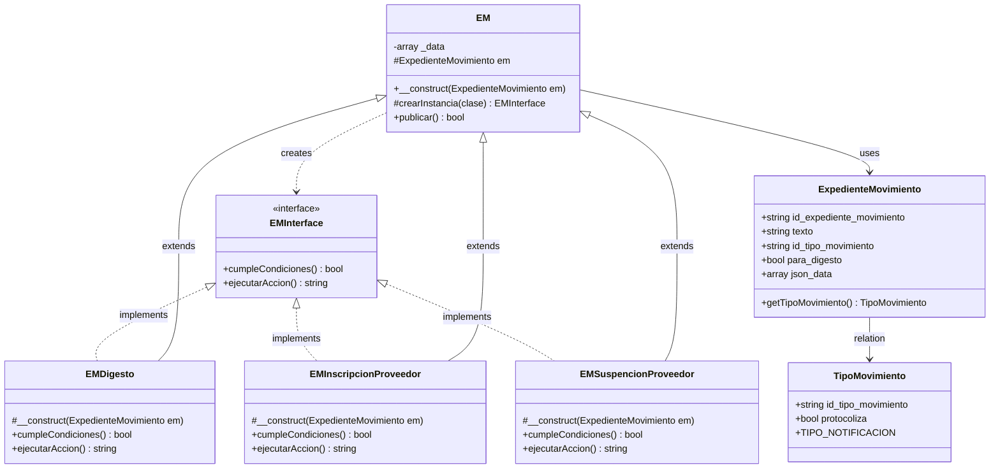

# Documentación - Sistema de Expediente Movimiento

## Diagrama de Clases



## Descripción del Patrón

### Patrón Factory con Constructor Protegido

Este diseño implementa un **patrón Factory** con restricción de instanciación:

- **EM**: Clase base que actúa como factory. Contiene el método `publicar()` que itera sobre todas las clases de acciones y las ejecuta si cumplen condiciones.
- **EMInterface**: Interfaz que garantiza que todas las acciones implementen `cumpleCondiciones()` y `ejecutarAccion()`.
- **Clases de Acción** (EMNotificacion, EMProtocolo, etc.):

  - Heredan de `EM`
  - Implementan `EMInterface`
  - Constructor `protected` → **Solo pueden ser instanciadas desde la clase EM** usando Reflection
  - Cada clase verifica sus propias condiciones y ejecuta su acción específica

### Flujo de Ejecución

1. Se crea una instancia de `EM` pasando un `ExpedienteMovimiento`
2. Se llama al método `publicar()`
3. `publicar()` itera sobre cada clase de acción registrada en `_data`
   ```php
   private array $_data = [
        'Notificacion' => EMNotificacion::class,
        'Protocolo' => EMProtocolo::class,
        'Digesto' => EMDigesto::class,
        'InscripcionProveedor' => EMInscripcionProveedor::class,
        'SuspencionProveedor' => EMSuspencionProveedor::class,
   ];

   public function publicar() {
        $transaction = \Yii::$app->db->beginTransaction();
        try {
            $respuesta = [];
            $respuesta[] = '- ' . $this->_defaultAction();
            foreach ($this->_data as $clase) {
                $instancia = $this->crearInstancia($clase);
                if ($instancia->_esTipo($instancia->getTipoMovimiento()) && $instancia->cumpleCondiciones()) {
                    $respuesta[] = '- ' . $instancia->ejecutarAccion();
                }
            }
            $transaction->commit();
            return implode("<br>", $respuesta);
        } catch (\Exception $e) {
            $transaction->rollBack();
            throw $e;
        }
    }
   ```
4. Usa `crearInstancia()` con Reflection para instanciar clases con constructor protegido
5. Verifica `cumpleCondiciones()` para cada acción
6. Ejecuta `ejecutarAccion()` si las condiciones se cumplen
7. Todo dentro de una transacción de base de datos

### Ventajas

- ✅ Encapsulación: Solo `EM` puede crear instancias de las acciones
- ✅ Extensibilidad: Agregar nuevas acciones es simple
- ✅ Transaccionalidad: Todas las acciones se ejecutan en una transacción
- ✅ Separación de responsabilidades: Cada acción tiene su lógica aislada


### Ejemplo de una Clase de Acción

```php
namespace app\models;

class EMInscripcionProveedor extends EM implements EMInterface
{
    const TIPOS_MOVIMIENTO = [
        TipoMovimiento::TIPO_DISPOSICION_AG,
    ];

    /**
     * Constructor protegido para evitar instanciación directa.
     * Solo puede ser instanciado desde la clase EM.
     */
    protected function __construct(ExpedienteMovimiento $em)
    {
        parent::__construct($em);
    }

    public function cumpleCondiciones(): bool
    {
        return !empty($this->em->json_data['InscripcionProveedor']);
    }

    public function ejecutarAccion(): string
    {
        return ("Inscripción Proveedor");
    }

    public function getTipoMovimiento(): array
    {
        return self::TIPOS_MOVIMIENTO;
    }
}
```
